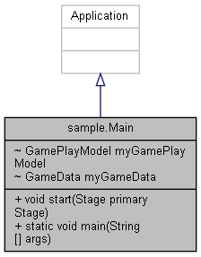

# Play Java
A mini game written in Java, to practice OOP.

## Idea

"Fantastic Four" will be a upgraded version of the classis "Connect Four" game. Two players can each in return select a column where they want to drop a chip in there represented colour. By using a "Super Power Chip" a player will be empowered to overwrite a occupied field on the board. 

## Concept

## UML class diagram

The software architecture of this game follows the MVC (model, view, controller) concept, where the programm logic is separated from the GUI (graphical user interface). The controller unit is the manages the information exchange between the modul (containing the game objects), and the view (representing the GUI, incl. GUI objects).

## Rules of the Game

Two players can each in return select a column where they want to drop a chip in there represented colour. The chip will be placed in the last empty row of that column. If a field in a column is taken, the following chip will be placed in the row above this field in the same column. If one player uses a Super Power Chip, she can overwrite a occupied field.

## GUI Mockup

Using Scene Builder a first GUI design is proposed. Based on this [FXML file](./data/FantasticFour_v1.fxml) the GUI mockup looks like this:  

## Open Questions

How or when do players get a Super Power Chip? (game design related question)  
Can a Player select a random colour other then red or blue before the game starts? (UI related question)

