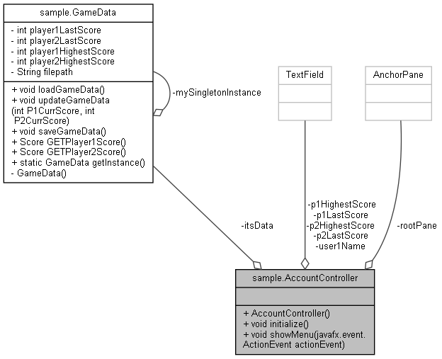
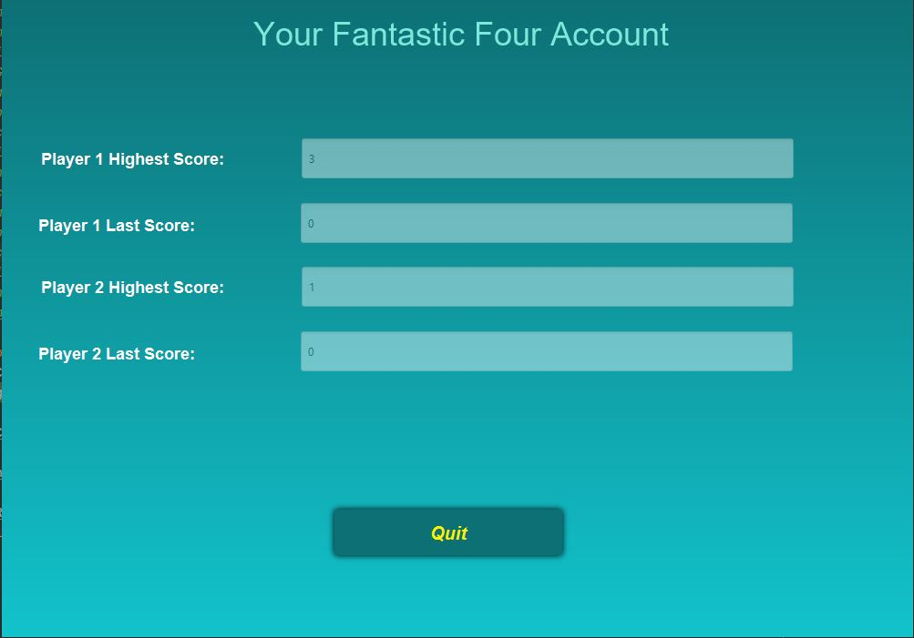
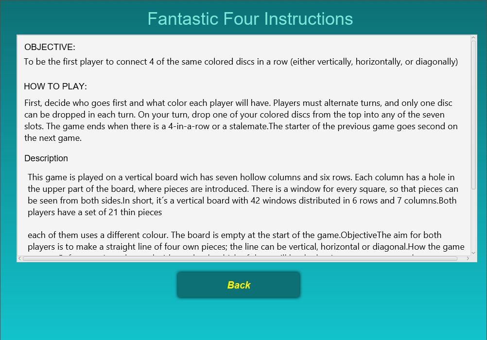

# Play Java
A mini game written in Java, to practice OOP.

## Idea

"Fantastic Four" will be a upgraded version of the classis "Connect Four" game. Two players can each in return select a column where they want to drop a chip in there represented colour.To be the first player to connect 4 of the same colored discs in a row (either vertically, horizontally, or diagonally)

## UML class diagram

The software architecture of this game follows the MVC (model, view, controller) concept, where the programm logic is separated from the GUI (graphical user interface). The controller unit is the manages the information exchange between the modul (containing the game objects), and the view (representing the GUI, incl. GUI objects).

updated version: https://miro.com/app/board/o9J_lHxQrZg=/

## Rules of the Game

Two players can each in return select a column where they want to drop a chip in there represented colour. The chip will be placed in the last empty row of that column. If a field in a column is taken, the following chip will be placed in the row above this field in the same column. 

## GUI Mockup

Using Scene Builder a first GUI design is proposed. Based on this [FXML file]

